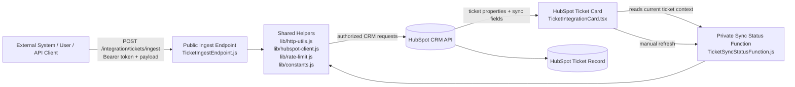
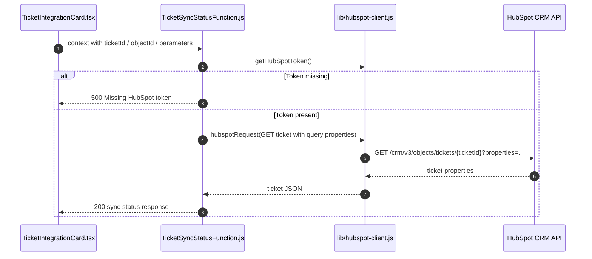

# ticket_cs System Workflow Diagram

This document shows how the current ticket integration works end-to-end, including the UI card, ingest endpoint, private sync-status function, HubSpot API calls, token-bucket throttling, and the exact data checks that happen along the way.

## 2-Way Sync ASCII Diagram

```text
                 TARGET 2-WAY SYNC BETWEEN INTEGRAL AND HUBSPOT

  +----------------------------+                      +----------------------------+
  | Integral Ticketing System  |                      | HubSpot CRM                |
  | (proprietary software)     |                      | ticket + metadata store    |
  +-------------+--------------+                      +-------------+--------------+
                |                                                     |
                | 1) ticket created or updated in Integral            |
                v                                                     |
  +-------------+---------------+                     +-------------+--------------+
  | Integral connector /        |                     | HubSpot Ticket Card        |
  | middleware / webhook relay  |                     | TicketIntegrationCard.tsx  |
  | - optional bridge layer     |                     | - reads current ticket     |
  | - used if Integral cannot   |                     | - shows sync status        |
  |   call HubSpot directly     |                     | - manual refresh button    |
  +-------------+---------------+                     +-------------+--------------+
                |                                                     |
                | 2) POST ticket payload + auth                       | 5) user opens    ticket card
                v                                                     v
  +-------------+-----------------------------------------------------+--------------+
  | TicketIngestEndpoint.js                                          | TicketSync... |
  | - authenticate caller                                            | Function.js   |
  | - normalize payload                                              | - resolve     |
  | - apply token bucket                                             |   ticketId    |
  | - search by external id                                          | - fetch props |
  | - create or update ticket                                        | - detect      |
  | - write sync metadata                                            |   missing map |
  +-------------+-----------------------------------------------------+--------------+
                |                                                     |
                | 3) dedupe + rate limit + write to HubSpot           | 6) GET ticket + sync fields
                v                                                     v
  +---------------------------+                      +----------------------------+
  | HubSpot CRM API           |                      | HubSpot CRM                |
  | - search by external id   |                      | - ticket record            |
  | - patch or create ticket  |                      | - sync metadata fields     |
  | - patch sync metadata     |                      +----------------------------+
  +---------------------------+

  Reverse path / future outbound sync to Integral:
  +----------------------------+                       +----------------------------+
  | HubSpot webhook / poller    |--------------------->| Outbound ticket exporter   |
  | or future worker            | 7) HubSpot ticket    | / Integral connector       |
  | - detect ticket created     |    created or changed| - build outbound payload   |
  | - read updated properties   |                      | - create or update ticket  |
  | - decide what Integral sees |                      |   in Integral              |
  +-----------------------------+                      +-------------+--------------+
                                                                    |
                                                                    | 8) POST mirrored ticket
                                                                    |    into Integral
                                                                    v
                                                   +----------------+-----------------+
                                                   | Integral Ticketing System        |
                                                   | - receives mirrored ticket       |
                                                   | - stores HubSpot-originated data |
                                                   | - can display it to users        |
                                                   +----------------------------------+

  Notes:
  - Current code supports Integral -> HubSpot writes and HubSpot -> UI reads.
  - The reverse branch above is the future feature for creating or updating Integral-side tickets from HubSpot events.
  - Middleware relay is the fallback if Integral cannot call HubSpot directly.
```

## Inconsistencies, Gaps, and Failure Modes

These are the places where the diagram does not yet match a fully finished two-way production sync, or where the current implementation can fail based on the remaining TODO items and current code paths.

### 1. It is not a true live two-way sync yet
- Current code supports Integral -> HubSpot writes and HubSpot -> UI reads.
- The reverse HubSpot -> Integral branch in the diagram is still future work.
- If someone reads the diagram as a finished bidirectional sync today, that would be inaccurate.

### 2. Deployment can fail before runtime starts
- TODO still shows missing required HubSpot secrets: `INTEGRATION_INGEST_TOKEN` and `HUBSPOT_PRIVATE_APP_TOKEN`.
- Until those exist, function deployment is blocked.
- If `HUBSPOT_PRIVATE_APP_TOKEN` is absent at runtime, both functions return `500` because HubSpot access cannot start.

### 3. Ingest can reject valid-looking requests
- If the bearer token does not match `INTEGRATION_INGEST_TOKEN`, the endpoint returns `401`.
- If the caller exceeds the token bucket, the endpoint returns `429`.
- If the payload does not include at least one of `subject`, `external_ticket_id`, or `hubspot_ticket_id`, the endpoint returns `400`.
- If Integral cannot send HTTPS requests or cannot format the payload correctly, the write path cannot start.

### 4. The system can create mapping warnings instead of full sync success
- If HubSpot custom property mappings are missing, sync metadata writes can return `400`.
- The code treats that as `mappingWarning` rather than a hard failure.
- This means the ticket may exist in HubSpot, but the integration status fields may be incomplete.

### 5. Duplicate prevention depends on the external id being present and consistent
- Dedupe only works when `external_ticket_id` is present and stable.
- If Integral omits that field, sends a different id for the same ticket, or changes its format, duplicate HubSpot tickets can be created.

### 6. Rate limiting is not globally shared across instances
- The limiter is in-memory.
- If HubSpot runs multiple function instances, each instance has its own bucket state.
- That means a user can be limited correctly on one instance but still get different behavior on another instance.

### 7. No durable queue means transient failures can lose events
- There is no queue, retry worker, or dead-letter queue yet.
- If HubSpot or the caller has a timeout, network interruption, or transient upstream failure, the event is not durably buffered.
- The caller must retry, or the ticket event can be lost.

### 8. The reverse path to Integral is still undefined
- The diagram now shows a future HubSpot -> Integral export path, but that worker/webhook/poller does not exist yet.
- If the goal is for HubSpot-created tickets to appear in Integral automatically, that feature still needs to be built and tested.

### 9. The current diagram assumes a bridge exists if Integral cannot call HubSpot directly
- The diagram includes a connector / middleware / webhook relay as an optional bridge.
- That bridge is only a fallback design, not a deployed component today.
- If Integral has no direct outbound HTTP capability and no middleware is added, the integration stops at the design level.

## ASCII Diagram

```text
          +-----------------------------+
          | External System / User      |
          | - sends ticket payload      |
          | - may send bearer token     |
          +-------------+---------------+
              |
              | POST /integration/tickets/ingest
              v
          +-------------+---------------+
          | TicketIngestEndpoint.js     |
          | 1. get HubSpot token        |
          | 2. validate bearer token    |
          | 3. parse + normalize input  |
          | 4. resolve rate-limit key   |
          | 5. consume 1 token          |
          | 6. dedupe by external id    |
          | 7. create/update ticket     |
          | 8. write sync metadata      |
          | 9. return status + stats    |
          +------+------+---------------+
            |      |
            |      |
            |      +---------------------------------------+
            |                                              |
            v                                              v
       +--------------+--------------+         +-----------+-----------+
       | lib/rate-limit.js            |         | lib/hubspot-client.js |
       | - in-memory token buckets    |         | - Bearer auth         |
       | - 30 tokens default          |         | - JSON requests       |
       | - 60 second window default   |         | - error classification|
       | - 429 when bucket empty      |         +-----------+-----------+
        +--------------+--------------+                     |
            |                                    +----------+
            |                                    |
            |                                    v
            |                     +--------------+--------------+
            |                     | HubSpot CRM API             |
            |                     | - search ticket by ext id   |
            |                     | - patch or create ticket    |
            |                     | - patch sync metadata       |
            |                     +--------------+--------------+
            |                                    |
            |                                    v
            |                     +--------------+--------------+
            |                     | HubSpot Ticket Record       |
            |                     | - subject                   |
            |                     | - content                   |
            |                     | - pipeline / stage          |
            |                     | - owner                     |
            |                     | - sync status fields        |
            |                     +-----------------------------+

          +-----------------------------+
          | HubSpot Ticket Card         |
          | TicketIntegrationCard.tsx   |
          | - reads current ticket      |
          | - shows sync status         |
          | - manual refresh button     |
          +--------------+--------------+
               |
               | calls private function
               v
          +-------------+---------------+
          | TicketSyncStatusFunction.js |
          | 1. resolve ticketId         |
          | 2. get HubSpot token        |
          | 3. fetch ticket fields      |
          | 4. detect missing mappings  |
          | 5. return status to card    |
          +-------------+---------------+
              |
              v
          +-----------------------------+
          | HubSpot CRM API             |
          | - GET ticket + properties   |
          +-----------------------------+

  Legend:
  - Ingest endpoint = write path
  - Card + private function = read path
  - Rate limit = per-caller token bucket
  - Dedupe = external_ticket_id lookup before create
  - Sync metadata = custom HubSpot fields updated after write
```

## High-Level System Map



## What Happens During Ticket Ingest

```mermaid
sequenceDiagram
  autonumber
  participant Client as External Client
  participant Endpoint as TicketIngestEndpoint.js
  participant RateLimit as lib/rate-limit.js
  participant Http as lib/http-utils.js
  participant HubSpotClient as lib/hubspot-client.js
  participant HubSpot as HubSpot CRM API

  Client->>Endpoint: POST /integration/tickets/ingest
  Note over Client,Endpoint: Request includes JSON body and optional Authorization header

  Endpoint->>HubSpotClient: getHubSpotToken()
  Note over Endpoint,HubSpotClient: Reads HUBSPOT_PRIVATE_APP_TOKEN / HUBSPOT_ACCESS_TOKEN / PRIVATE_APP_TOKEN
  HubSpotClient-->>Endpoint: token string or empty

  alt HubSpot token missing
    Endpoint-->>Client: 500 Missing HubSpot token
  else HubSpot token present
    Endpoint->>Http: parsePayload(context)
    Note over Endpoint,Http: Accepts body, event.payload, or parameters; parses JSON if needed
    Http-->>Endpoint: normalized payload object

    Endpoint->>Http: resolveRateLimitKey(context, payload)
    Note over Endpoint,Http: Uses x-rate-limit-user, x-user-id, x-forwarded-for, x-real-ip, cf-connecting-ip, or authorization fallback
    Http-->>Endpoint: rate-limit key string

    Endpoint->>RateLimit: consumeRateLimitToken(key, config)
    Note over Endpoint,RateLimit: Default policy is 30 tokens per 60-second window unless env vars override it
    alt Bucket still has tokens
      RateLimit-->>Endpoint: allowed=true, remaining token count, reset time
    else Bucket empty
      RateLimit-->>Endpoint: allowed=false, retryAfterSeconds, resetAt
      Endpoint-->>Client: 429 rate limit exceeded
    end

    alt Payload invalid
      Endpoint-->>Client: 400 invalid payload
    else Payload valid
      Endpoint->>HubSpotClient: findExistingTicketByExternalId(token, external_ticket_id)
      HubSpotClient->>HubSpot: POST /crm/v3/objects/tickets/search
      Note over HubSpotClient,HubSpot: Searches by custom property external_ticket_id
      HubSpot-->>HubSpotClient: search results or 400 if mapping missing
      HubSpotClient-->>Endpoint: existing ticket id or mappingMissing flag

      alt external_ticket_id mapping missing or not found
        Endpoint->>HubSpotClient: POST /crm/v3/objects/tickets
        Note over Endpoint,HubSpotClient: Creates new ticket using mapped subject/content/priority/pipeline/stage/owner fields
        HubSpotClient->>HubSpot: POST /crm/v3/objects/tickets
        HubSpot-->>HubSpotClient: created ticket id
        HubSpotClient-->>Endpoint: created.id
      else Existing ticket found
        Endpoint->>HubSpotClient: PATCH /crm/v3/objects/tickets/{ticketId}
        Note over Endpoint,HubSpotClient: Updates existing ticket instead of duplicating it
        HubSpotClient->>HubSpot: PATCH /crm/v3/objects/tickets/{ticketId}
        HubSpot-->>HubSpotClient: updated ticket response
      end

      Endpoint->>HubSpotClient: PATCH /crm/v3/objects/tickets/{ticketId}
      Note over Endpoint,HubSpotClient: Writes sync metadata fields after the main create/update step
      HubSpotClient->>HubSpot: PATCH sync fields
      alt Custom property mapping exists
        HubSpot-->>HubSpotClient: 200 OK
        HubSpotClient-->>Endpoint: sync metadata saved
      else Custom property mapping missing
        HubSpot-->>HubSpotClient: 400 bad request
        HubSpotClient-->>Endpoint: 400 caught as mappingWarning
      end

      Endpoint-->>Client: 200 success + rateLimit metadata + sync status
    end
  end
```

## Ingest Request Processing Details

### 1. Authentication and access control
- The endpoint first checks for a HubSpot private app token.
- If the token is missing, the request stops immediately with `500`.
- If `INTEGRATION_INGEST_TOKEN` is configured, the request must include `Authorization: Bearer <token>`.
- If the bearer token does not match, the endpoint returns `401`.

### 2. Payload normalization
The ingest payload accepts both snake_case and camelCase fields.

Mapped inputs include:
- `external_ticket_id` or `externalTicketId`
- `source_system` or `sourceSystem`
- `subject` or `title`
- `content` or `description`
- `priority`
- `pipeline`
- `stage` or `ticket_stage`
- `owner` / `ownerId` / `hubspot_owner_id`
- `event_id` / `eventId`
- `event_type` / `eventType`
- `event_timestamp` / `eventTimestamp`
- `hubspot_ticket_id` / `hubspotTicketId` / `ticketId`

### 3. Rate limiting
The endpoint uses a token bucket per caller key.

Key behavior:
- Each caller gets a bucket of 30 tokens by default.
- The bucket refills every 60 seconds by default.
- A request consumes one token before any HubSpot write occurs.
- When the bucket is empty, the request is blocked with `429`.
- The response includes `limit`, `remaining`, `retryAfterSeconds`, and `resetAt`.

Caller key precedence:
1. `x-rate-limit-user`
2. `x-user-id`
3. `x-forwarded-for`
4. `x-real-ip`
5. `cf-connecting-ip`
6. `authorization`
7. fallback: `anonymous`

### 4. Idempotency and dedupe
If `external_ticket_id` is present:
- the endpoint searches HubSpot for an existing ticket with that value;
- if found, it updates that ticket;
- if not found, it creates a new ticket;
- if the search mapping is missing or not yet configured, the endpoint continues and creates a ticket, but marks a mapping warning when appropriate.

### 5. Ticket property writes
The endpoint maps the normalized payload to HubSpot ticket properties:
- `subject`
- `content`
- `hs_ticket_priority`
- `hs_pipeline`
- `hs_pipeline_stage`
- `hubspot_owner_id`

### 6. Sync metadata writes
After the create/update step, the endpoint writes integration metadata back onto the ticket:
- external ticket id
- source system
- sync status
- last sync timestamp
- last sync result
- last webhook event id

If these custom properties are not mapped yet in HubSpot, that second metadata write can return `400`; the code handles that as a `mappingWarning` rather than failing the whole request.

### 7. Final response
On success, the endpoint returns:
- `success: true`
- `operation: created` or `updated`
- `ticketId`
- `dedupedByExternalTicketId`
- `externalTicketId`
- `sourceSystem`
- `webhookEventId`
- `webhookEventTimestamp`
- `mappingWarning`
- `status`
- `rateLimit` info

On failure, the endpoint uses a HubSpot-aware failure classifier:
- `401` -> auth failed
- `403` -> permission denied
- `429` -> rate limited
- `5xx` -> upstream error mapped to `502`
- other failures -> `500`

## What Happens in the Ticket Card

```mermaid
flowchart TD
  OpenCard[User opens HubSpot Ticket record] --> Context[HubSpot provides ticket context]
  Context --> Resolve[resolveTicketId(context)]
  Resolve -->|ticketId found| Fetch[Private sync-status function fetches ticket from HubSpot]
  Resolve -->|missing ticketId| Error400[Return 400 missing ticketId]
  Fetch --> Properties[Request ticket + integration properties from HubSpot]
  Properties --> StatusModel[Build sync status model for UI]
  StatusModel --> Render[Render SyncStatusPanel in TicketIntegrationCard]
  Render --> Refresh[User clicks Refresh status]
  Refresh --> Fetch
```

### Ticket card behavior details
- The card is ticket-scoped and only renders in the ticket record context.
- It resolves the active ticket id from HubSpot-provided context fields.
- It calls the private sync-status function instead of reading HubSpot directly from the UI.
- It shows the current sync state, last sync time, last sync result, source system, external id, and last webhook event id.
- It surfaces special UI states for API failure, missing mapping, and webhook delay warnings.
- The manual refresh action re-queries the private function and updates the visible state.

## What the Private Sync-Status Function Does



### Sync-status function details
- Resolves `ticketId` from explicit parameters first.
- Falls back to HubSpot context (`propertiesToSend`, `object`, `objectId`) if needed.
- Fetches native HubSpot ticket properties plus custom integration fields.
- Returns `missingMappings` so the card can show when custom fields are absent.
- Defaults sync state to `not_synced` when no integration metadata exists.

## Shared Helper Layer

The backend functions share a small helper layer so the logic stays consistent.

Gist: the helper layer is the shared plumbing for both functions. It handles HubSpot auth, consistent response formatting, safe payload and ticket-id parsing, shared property names, structured HubSpot error mapping, and per-caller rate limiting so the ingest endpoint and sync-status function do not duplicate the same low-level logic.


### `lib/constants.js`
- Defines `HUBSPOT_API_BASE`.
- Centralizes custom property names.
- Allows property key overrides through environment variables.

### `lib/hubspot-client.js`
- Resolves HubSpot API token from supported env vars.
- Calls HubSpot with a Bearer token and JSON headers.
- Parses responses and throws structured errors.
- Classifies common HubSpot failures into user-facing status codes.

### `lib/http-utils.js`
- Sends consistent `{ statusCode, body }` responses.
- Resolves request headers case-insensitively.
- Parses JSON payloads from multiple possible context shapes.
- Resolves ticket ids from multiple HubSpot context formats.
- Resolves rate-limit keys from headers and fallback context.

### `lib/rate-limit.js`
- Maintains in-memory token buckets.
- Keeps bucket state keyed by user/caller identity.
- Refills buckets after the configured window.
- Returns `allowed`, `remaining`, `retryAfterSeconds`, and `resetAt` for response payloads.

## Important Runtime Characteristics

### What is durable
- HubSpot tickets are durable once written to HubSpot.
- Custom sync metadata is durable once the metadata PATCH succeeds.
- Idempotency is durable across repeated ingest calls because HubSpot is queried by `external_ticket_id`.

### What is not durable yet
- Token bucket state is in-memory only.
- The limiter is not globally shared across multiple function instances.
- There is no queue or dead-letter queue yet.
- A transient failure can still be lost unless the client retries.

### Why this still works well today
- The endpoint rejects overloaded callers early.
- HubSpot writes are classified and reported clearly.
- The system avoids duplicate tickets through external-id dedupe.
- The card always reflects the latest ticket sync state in HubSpot.

## Current Operational Flow Summary

1. An external system or user sends a ticket ingest request.
2. The endpoint validates HubSpot token availability.
3. If configured, the endpoint validates the shared ingest bearer token.
4. The request payload is parsed and normalized.
5. The caller is rate-limited with a token bucket.
6. The endpoint dedupes by `external_ticket_id` when possible.
7. The endpoint updates or creates the HubSpot ticket.
8. The endpoint writes integration sync metadata back to the ticket.
9. The endpoint returns success, rate-limit metadata, and any mapping warning.
10. A user opens the ticket card and the card queries the private sync-status function.
11. The card displays the current sync state and allows manual refresh.

## Presentation Notes
- The current design is optimized for correctness, maintainability, and HubSpot compatibility.
- The ingest path protects HubSpot with a per-caller token bucket.
- Dedupe prevents duplicate tickets for repeated external ids.
- The card is read-only and uses the private function for status.
- The future roadmap includes durable queuing, retries, dead-letter handling, and global rate limiting.
